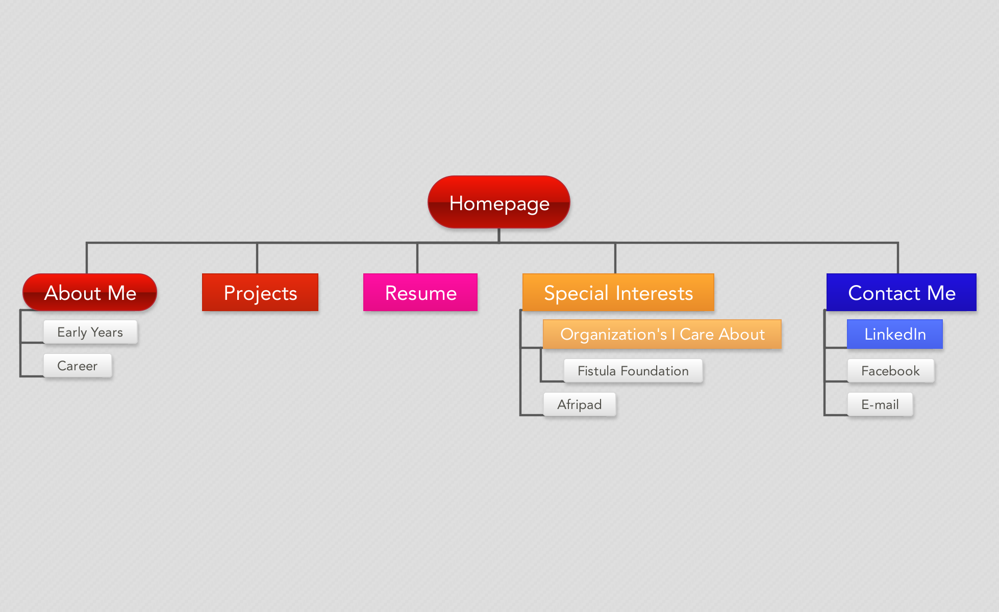

<!----->

What are the 6 Phases of Web Design?
The six stages of web design include the following:

1. Information Gathering
2. Planning
3. Design
4. Development
5. Testing and Delivery
6. Maintenance

What is your site's primary goal or purpose?

The primary purpose of my site is to share information regarding the things I learn during Phase 0 at DBC. I will reflect on what this learning process has been, and will showcase the strengths, weakness, the challenges I overcomes, and the emotional rollercoaster that I experienced along the way.

What kind of content will your site feature?

My site will feature MY personal reflection of my learning process. I may share things I learned, emotions I felt, challenges that I have experienced, and everything in between. This will be an honest account of my journey through Phase 0.

What is your target audience's interests and how do you see your site addressing them?

My target audience is really for those that are underrepresented in the tech world and want to get started, but are afraid. I feel my site will give them an opportunity to understand, yes this process is hard, but it can be done, and WE should do it. My site will offer courage to someone that is uncertain about whether they should take this path, despite their lack of experience or background in CS.

What is the primary "action" the user should take when coming to your site? Do you want them to search for information, contact you, or see your portfolio? It's ok to have several actions at once, or different actions for different kinds of visitors.

The primary action for users visiting my site and to get information and also give people the opportunity to contact me if they choose to.

What are the main things someone should know about design and user experience?

Based on all of the inforamtion gathered from the reading, I would have to say that one of the main things someone should know about User design and experience is that the design and user experience can really dictate the success of the website. The website should offer its visitors value, be easy to use, and a plesant experience.

What is user experience design and why is it valuable?

User Experience (UX) is how a person feels when they are interfacing with a system such as a website or app. UX design focuses on ensuring that the user experience is always a pleasant, easy to use, and has some value. Without thinking about UX companies run the risk of having a site that does not provide the type of experience the user is looking for, and therefore, the user may choose not to return to the site.

Which parts of the challenge did you find tedious?

I had a difficult time figuring out the relative path, and absolute path. I did not feel as though the instructions were very clear. However, once I figured out what I needed to do, I was able to identify the necessary steps needed to accomplish the task.