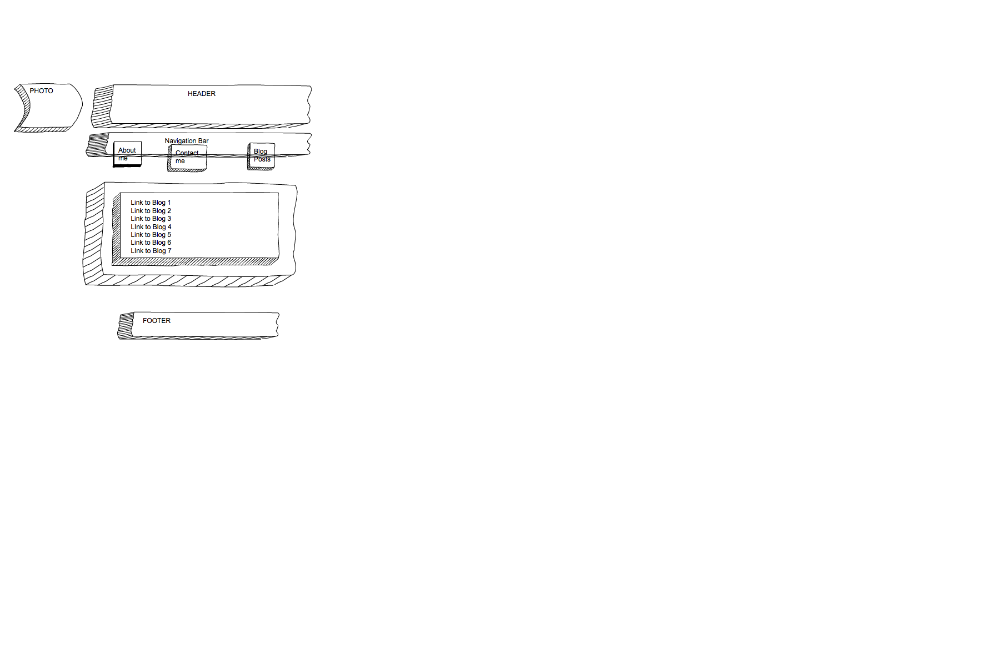
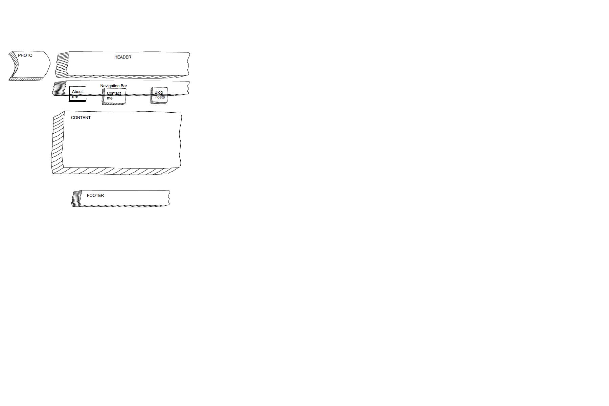
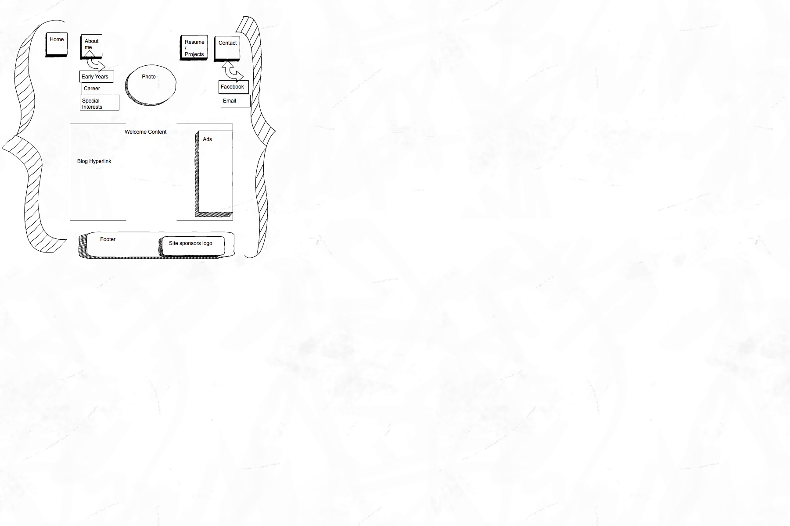
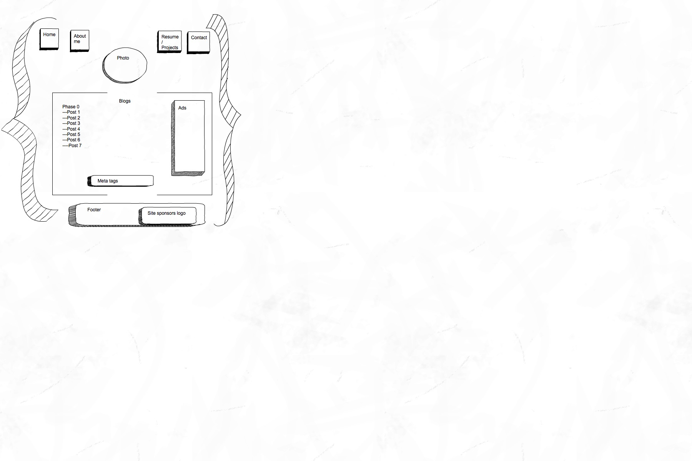

<!---->

<!---->

-->

-->

<b>What is a wireframe?</b>

A website wireframe, is the equivalent to a blueprint...it is basically a visual guide that represents the skeletal framework of a website. Wireframes are created for the purpose of arranging components of the site to best accomplish a particular purpose for a clients needs/wants.

<b>What are the benefits of wireframing?</b>

A few of the benefits of wireframing include:

1. It allows you to visualize the content layout of the page
2. It allows you to evaluate the effectiveness of the page layout again usability best practices
3. It determines the requirement of the web site development
4. It saves time and effort-if a client sees a completed design without a wireframe, it may take a considerable amount of time and money to correct.
5. Simplifies the coding process since the elements are outlined early on.

<b>Did you enjoy wireframing your site?</b>

First response: I think I could enjoy wireframing a lot more than I did today. I felt a bit rushed today, and because of it, I didn't enjoy the process as much. But since I really enjoy putting together power point presentations in ways that I think are esthetically pleasing, I believe I could really enjoy doing wireframing. Second response: After coming back to wireframing after this assignment was submitted, I really began to enjoy the process. It's fun, its instantaneous and you get the opportunity to test out and learn about variations of layouts that work and don't work.

<b>Did you revise your wireframe or stick with your first idea?</b>

I revised my framework 2-4x, but I only made slight changes to the lay out of the content. As I prepared to do the solo challenge, I simplified my wireframe again to simplify the steps that I was preparing to learn.

<b>What questions did you ask during this challenge? What resources did you find to help you answer them? </b>

I asked myself questions about websites I currently visit often and enjoy. I took a look at my wedding website, and the blog I write for and compared the lay out to see what ideas worked well that I could borrow. I also used the free trial on SimpleDiagrams to design my wireframe. I am not good at drawing, so I found that to be pretty helpful.

<b>Which parts of the challenge did you enjoy and which parts did you find tedious? </b>

I am still having issues with relative path. I kept getting a blue box with a question mark for my imgs. I also didn't enjoy the process of looking for a free-site I could use that was intuitive to me. I know that it'll take time to figure out which resources work best, but since I am still learning a lot, it felt tedious trying to find the one that I could use easily. I enjoyed greating the wireframe, I thought that process was a little fun, and it was nice to get into the mind set of a web site designer. I felt like I was beginning to understand how all of this can begin to come together.
