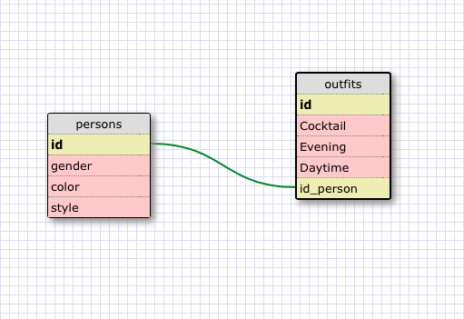

1. SELECT * FROM states;
2. SELECT * FROM regions;
3. SELECT state_name, population FROM states;
4. SELECT state_name, population FROM states ORDER BY population DESC;
5. SELECT state_name FROM states WHERE region_id = 7;
6. SELECT state_name, population_density FROM states WHERE population_density > 50 ORDER BY population_density ASC;
7. SELECT state_name FROM states WHERE population BETWEEN 1000000 and 1500000;
8. SELECT state_name, region_id FROM states ORDER BY region_id ASC;
9. SELECT region_name FROM regions WHERE region_name LIKE '%Central%';
10. SELECT regions.region_name, states.state_name FROM regions JOIN states ON regions.id = states.region_id ORDER BY states.region_id;

<!-- What are databases for? Databases are used to store information 
What is a one-to-many relationship? One-to-One (1-1) relationship is defined as the relationship between two tables where both the tables should be associated with each other based on only one matching row. This relationship can be created using Primary key-Unique foreign key constraints.
What is a primary key? What is a foreign key? How can you determine which is which? The PRIMARY KEY constraint uniquely identifies each record in a database table. A FOREIGN KEY in one table points to a PRIMARY KEY in another table. You can tell it is a primary key because none of the values are null, and each value in the colum is unique. You 
How can you select information out of a SQL database? What are some general guidelines for that? use SELECT (name of colum) FROM (name of table); Start by using SELECT followed by the name of the column in lower case letters, then FROM followed by the name of the table in lower case letters, and end it with a semicolon.  -->