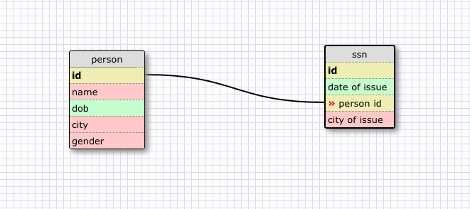
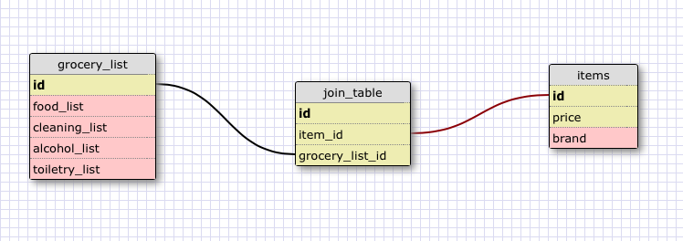

What is a one-to-one database?

 	A One-to-One relationship means that you have two tables that have a relationship, but that relationship only exists in such a way that any given row from Table A can have at most one matching row in Table B. An example  that I used was a person has 1 ssn, and a ssn is associated with 1 person. 

When would you use a one-to-one database? (Think generally, not in terms of the example you created). 

	When you want to see the relationship between an artist and the rooms an art piece can be placed. For example, a room can have many pieces of art in it, and an art piece can only belong in one room. 

What is a many-to-many database? 

	The many-to-many database relationship is used when you are in the situation where the rows in the first table can map to multiple rows in the second table… and those rows in the second table can also map to multiple (different) rows in the first table.

When would you use a many-to-many database? (Think generally, not in terms of the example you created). 

	I could use many -to- many databases when you are trying to establish a relationship between authors and books. For example, when you have an author that has many books, and books can have many authors. That is 

What is confusing about database schemas? What makes sense? 

	It all seems to be rather straight forward. I like SQL way more than I like JS. 
